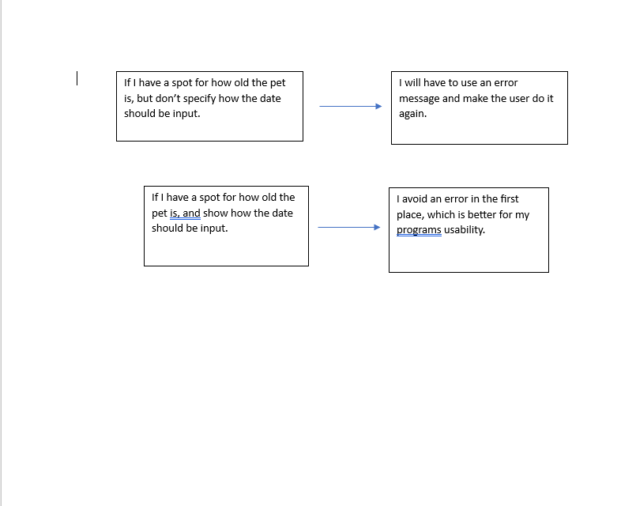
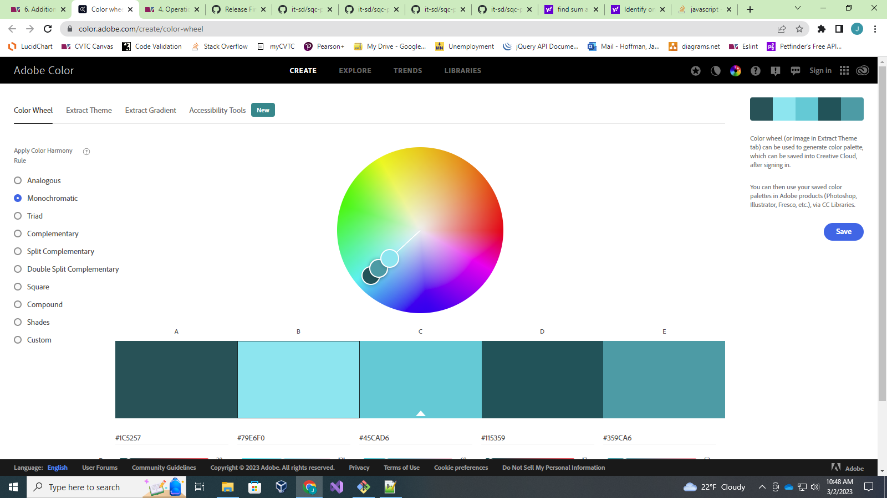

Consistency and standards
---------------------------
I would like to increase consistency and standards. My site is a little all over the place right now and I havent gotten around to making it pretty yet. More consistency with layout would help a lot I think, and is important to users. The less wondering and confusion about my site, the better.

Error prevention
----------------
I would like to increase error prevention. Error prevention is not one of my strong points, and the code to do error messages is something I dont have much experience with yet. Making sure I dont have any errors or take in errors from users in the first place is important and I should focus on that too, along with implementing error messages. 

  

Typography and Color Scheme
---------------------------
I think I will use two different fonts, one for headers, and the other for simple paragraphs. I do this to keep my site simple and not too crazy for readers. These fonts will be Sans Serif, and Ariel Nova.  I will make sure to pay attention to line spacing too, I think that is important for making the site look good. Bold is great for emphasizing things in my site too, like maybe for a pet who has been in the shelter a while. 

The reason I chose my color scheme is also because I wanted things to be not too flashy, just two colors of similar color is good for a site about adoption. I want to keep it about the pets. 

